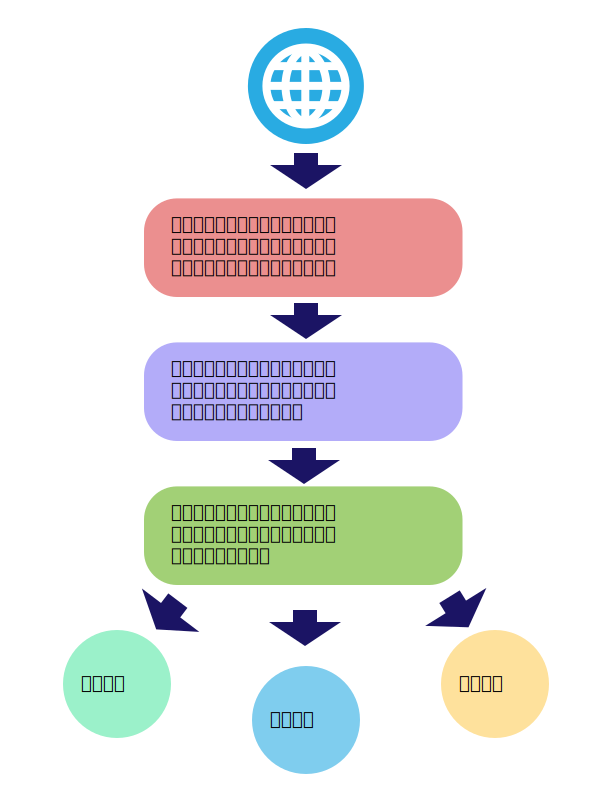

# Java编程技能训练课程大项目——新闻热点与趋势挖掘工具

小组成员： 孙明月 张玉英 魏钊旸

创建日期：2015年12月10日  最后修改日期：2015年12月31日

#

## 项目概述

### 项目简介

本项目为一个新闻站点文章爬取和分析工具，能够通过抓取一定时间内某个新闻网站上所发布的所有新闻，分析得出某些极具参考价值的数据结论如新闻热点和舆论变化趋势等等。本项目所实现的网络工具主要包含以下三个功能：

* 年度关键词分析

      通过抓取和分析一年以来新闻站点所发布的文章内容，分析一年内最受关注的新闻热点词汇

* 热门词汇趋势

      以月为单位呈现某些新闻要素的曝光率以及变化趋势

* 相关度分析

      深度研究已经得到的数据，挖掘某些新闻要素所隐含的联系

### 项目架构

本项目程序使用Java程序开发设计，程序包含数据爬取＋数据分析两个环节的工作。项目使用阿里云平台作为运行环境，所有数据挖掘工作都将在云端执行，所获得的原始数据将在本地作进一步处理。

### 优势比较 

与其他产品相比较，本项目的特点和优势在于以下三个方面：

* 轻量级网络程序，开放API以供调用
* 使用云计算平台，效率高，运行稳定
* 实时的数据采集和分析过程，灵活性好

## 项目流程

### 技术难点

### 任务分工

* 云计算平台搭建及网络爬取功能开发

      包括阿里云平台的搭建和维护以及程序第一部分（网站内容爬取）的开发工作，由张玉英同学负责。

* 数据分析功能开发及项目文档撰写

      包括程序第二部分（数据分析）的实现和项目进展程度的追踪以及项目文档的撰写工作，由魏钊旸同学负责。

* 数据深度分析及项目演示工作

      包括使用统计工具对原始数据的深度分析以及项目的现场展示工作，由孙明月同学负责。
      
## 文件结构说明

* readme		项目详情说明
* scrapy		网络爬虫代码，
* hdParse		hadoop处理爬虫结果，排序等等
* result		网络数据爬取结果
* infographics	数据分析结果信息图谱
* flow			项目架构图

## 项目架构说明

项目架构及运行流程如下图所示：

## 资源引用

### 数据来源

本项目所使用的统计数据来自新华网以及百度新闻在2015年度所公开发布的所有新闻。

### 网络爬虫设计

网络爬虫的设计过程参考了开源项目[WebMagic](https://github.com/code4craft/webmagic)的相关内容

### 文章分词功能

文章分词功能使用[NLPIR汉语分词系统](http://ictclas.nlpir.org/newsdownloads?DocId=389)实现。

